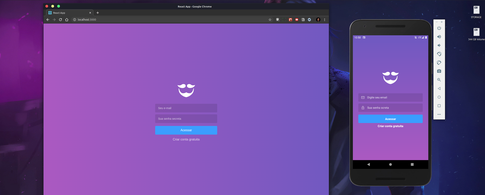
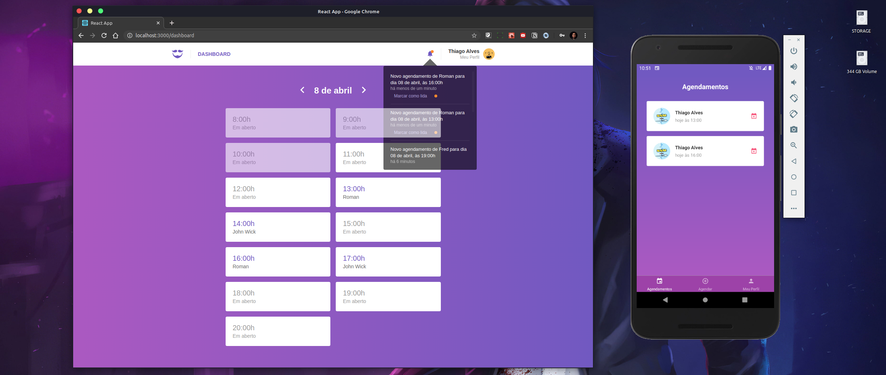

GOBARBER
</h1>

GoBarber é um sistema de cadastro para prestadores de serviços de barbearia. A aplicação web conta com a parte decadastro de prestadores de serviços. E sua aplicação mobile conta com o cadastro de usuários para escolherem o prestador e agendar um horário para ser atendido. Projeto desnvolvido durante o Bootcamp GoStack 10 da Rocketseat.

  

[//]: # (Add your gifs/images here:)

  
  

## Features
[//]: # (Add the features of your project here:)
Principais tecnologias usadas nesta aplicação:

- 💹 **Node Js** — Back-end
- ⚛️ **React Js** — Front-end
- ⚛️ **React Native** — Mobile - Android e iOS
- ⚛️ **Postgres/Sequelize** — Banco de dados
- ⚛️ **Docker** — Gerenciamento dos bancos de dados

- ⚛️ **Outras tecnologias**
Redux
Redux-Saga
React Navigation
Axios
Immer
styled-components
react-native-vector-icons
Reactotron
ESlint
Prettier

## Instalação e uso

git clone https://github.com/the-one-who-knoccks/GoBarber-Master

Acesse a pasta Backend_Gobarber e siga os passos abaixos:

Para instalar as dependências rode o comando:
# yarn

Instalar, criar e subir um banco de dados Postgres pelo docker

# docker run --name postgresfastfeet -e POSTGRES_PASSWORD=fastfeet -p 5432:5432 -d postgres:11

# docker start postgresfastfeet

Instalar, criar e subir um banco de dados Redis pelo docker

# docker run --name redisfastfeet -p 6379:6379 -d -t redis:alpine

# docker start redisfastfeet

Acesse o banco postgres com um gerenciador como, no meu caso usei o Postbird e após isso,  crie o banco com nome de gobarber

Siga o arquivo .env.example para setar as configurações

Para startar o servidor, rode o comando:
# yarn dev

* Front-end
Acesse a pasta Front-end-Gobarber e rode o comando abaixo para instalar as dependências:
# yarn

Para iniciar a aplicação, rode:
# yarn start

* Mobile APP -

Acesse a pasta Mobile_Gobarber e navegue até a pasta src/services e no arquivo api.js, defina o url/localhost do seu emulador. Depois vá até src/config/ReactotoronConfig e altere a parte ".configure({ host: 'ip da sua maquina aqui })" Após isso, rode o comando abaixo para instalar as dependências:
# yarn

Apos estar com o seu  emulador ou celular conectado, abra o terminal na pasta Mobile_Gobarber e rode o comando:
# react-native run-Android ou run-IOS

Em seguida apóis finalizar a instalação, rode: 
# react-native start ou yarn start
Em uma guia do terminal, rode:

## License

This project is licensed under the MIT License - see the [LICENSE](https://opensource.org/licenses/MIT) page for details.

